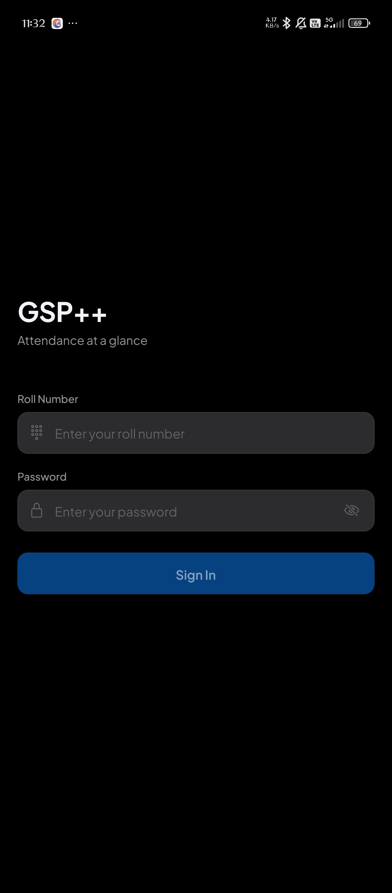
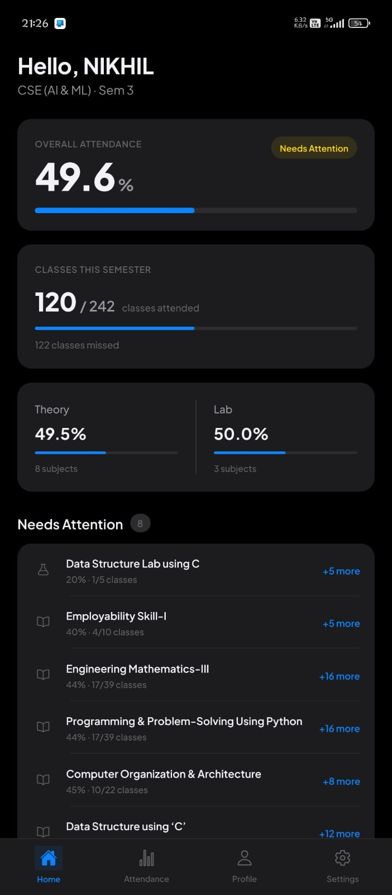
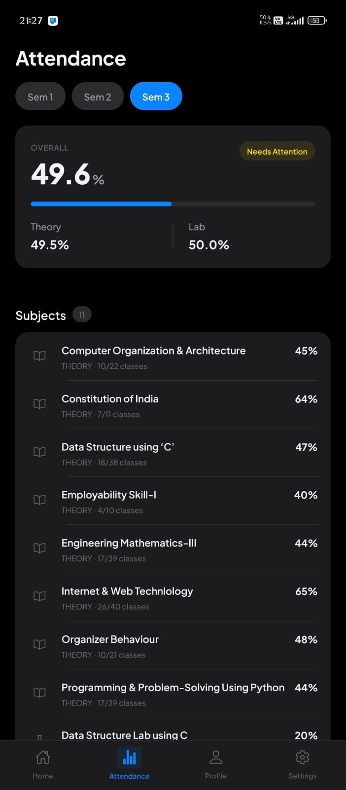
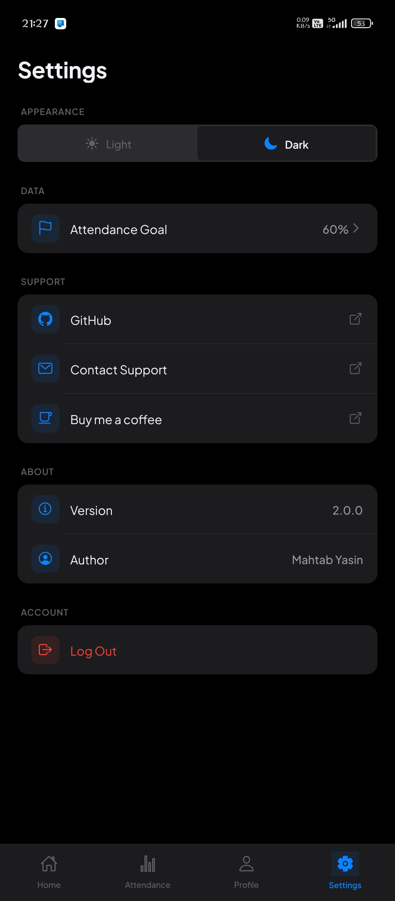

# GSP++

  

  <strong>A modern, privacy-focused mobile attendance application built with React Native and Expo.</strong>

  View, track, refresh and manage university attendance through a clean mobile interface.

  
  
  
  
  

  <a href="https://github.com/mahtab89/GSP/releases">Download</a>
  &nbsp;&nbsp;•&nbsp;&nbsp;
  <a href="https://github.com/mahtab89/GSP/issues">Report an Issue</a>
  &nbsp;&nbsp;•&nbsp;&nbsp;
  <a href="https://github.com/mahtab89/GSP">View Source</a>

---

## About

**GSP++** is a mobile attendance application designed to make university attendance easier to access, understand, and track.

Instead of navigating through a traditional university portal, students can use GSP++ to view their attendance through a clean mobile interface.

The application connects directly to the university portal, retrieves the attendance response, parses the required information locally, and presents it in an organized format.

### Core Principles

<table>
<tr>
<td width="33%" align="center">

### Privacy

Attendance data stays between the device and the university portal.

</td>

<td width="33%" align="center">

### Simplicity

Important attendance information is presented without unnecessary complexity.

</td>

<td width="33%" align="center">

### Transparency

The project is open source and its implementation can be inspected.

</td>
</tr>
</table>

---

# Features

<table>
<tr>
<td width="50%" valign="top">

## Attendance Dashboard

View overall attendance percentage immediately after logging in.

Track your attendance without navigating through multiple portal pages.

</td>

<td width="50%" valign="top">

## Subject Breakdown

Get detailed attendance information for every subject.

View attended classes, total classes, and calculated attendance percentage.

</td>
</tr>

<tr>
<td width="50%" valign="top">

## Theory & Laboratory

Theory and practical subjects are organized separately for easier navigation.

This makes it easier to understand where attendance is being accumulated or missed.

</td>

<td width="50%" valign="top">

## Semester Switching

Switch between available semesters without going through the university portal repeatedly.

</td>
</tr>

<tr>
<td width="50%" valign="top">

## Offline Access

Previously fetched attendance data is cached locally.

You can still view the latest available information when the network is unavailable.

</td>

<td width="50%" valign="top">

## Pull to Refresh

Refresh attendance manually whenever you need the latest information.

</td>
</tr>

<tr>
<td width="50%" valign="top">

## Theme Support

Automatically adapt to the system theme with support for manual light and dark mode selection.

</td>

<td width="50%" valign="top">

## Last Updated

See when the attendance information was last successfully retrieved from the university portal.

</td>
</tr>
</table>

---

# How It Works

The application follows a straightforward request-and-parse architecture.

### 01 — Authentication

The user provides their university portal credentials through the application.

### 02 — Portal Request

GSP++ communicates directly with the university portal to request the relevant attendance information.

### 03 — Response Parsing

The returned HTML response is processed locally on the device.

### 04 — Data Extraction

Relevant attendance information is extracted, including:

* Subject name
* Classes attended
* Total classes
* Attendance percentage
* Theory or practical classification
* Semester information

### 05 — Local Storage

The latest attendance information is cached locally to provide offline access.

### 06 — Presentation

The processed information is displayed through the GSP++ mobile interface.

---

# Privacy & Security

Privacy is one of the primary design goals of GSP++.

<table>
<tr>
<td width="50%" valign="top">

### No External Backend

GSP++ does not require an external attendance server.

Communication is made directly with the university portal.

</td>

<td width="50%" valign="top">

### Local Credentials

Credentials are stored locally using **Expo Secure Store**.

</td>
</tr>

<tr>
<td width="50%" valign="top">

### No Analytics

The application does not intentionally collect usage analytics or behavioral tracking data.

</td>

<td width="50%" valign="top">

### Local Cache

Cached attendance information remains on the user's device.

</td>
</tr>

<tr>
<td width="50%" valign="top">

### Open Source

The complete source code is available for inspection and contribution.

</td>

<td width="50%" valign="top">

### Direct Communication

Attendance requests are designed to communicate directly between the application and the university portal.

</td>
</tr>
</table>

---

# Technology Stack

<table>
<tr>
<td align="center" width="25%">

### React Native

Cross-platform mobile application framework.

</td>

<td align="center" width="25%">

### Expo

Development platform and toolchain.

</td>

<td align="center" width="25%">

### TypeScript

Type-safe application development.

</td>

<td align="center" width="25%">

### React Native SVG

Attendance visualization and progress components.

</td>
</tr>
</table>

### Supporting Technologies

| Technology                     | Role                                 |
| ------------------------------ | ------------------------------------ |
| Expo Secure Store              | Secure credential storage            |
| AsyncStorage                   | Local data caching                   |
| React Native Safe Area Context | Safe-area and device layout handling |
| Expo Vector Icons              | Interface icons                      |
| React Native SVG               | Circular attendance visualizations   |

---

# Screenshots

   
  &nbsp;&nbsp;&nbsp;
   
  &nbsp;&nbsp;&nbsp;
  
  &nbsp;&nbsp;&nbsp;
  

  GSP++ mobile interface

---

# Download

The latest Android APK is available through GitHub Releases.

  

### Installation

Download the latest APK from the Releases page and install it on your Android device.

Because GSP++ is currently distributed outside the Google Play Store, Android may display a warning for apps installed from outside the Play Store.

Always verify that the APK comes from the official project repository before installing it.

---

# Contributors

GSP++ is built with the help of everyone who contributes code, ideas, testing, documentation, and feedback.

  

  Thank you to everyone who contributes to GSP++.

### Want to Contribute?

If you have an idea, found a bug, or want to improve something, feel free to open an issue or submit a pull request.

---

# Disclaimer

GSP++ is an independent and unofficial application.

It is not affiliated with, sponsored by, or officially endorsed by any university, institution, or university portal referenced by the application.

Users are responsible for:

* Their own login credentials
* Their use of the application
* Verifying attendance information with the official university portal

The application is provided for educational and personal-use purposes.

---

# License

This project is open source.

See the [LICENSE](https://github.com/mahtab89/GSP/blob/main/LICENSE) file for the license and terms of use.

---

# Author

## Mahtab Yasin

Independent Developer & Creator of GSP++

  

---

  Built with React Native, Expo and TypeScript.

  <a href="#gsppp">Back to top</a>

